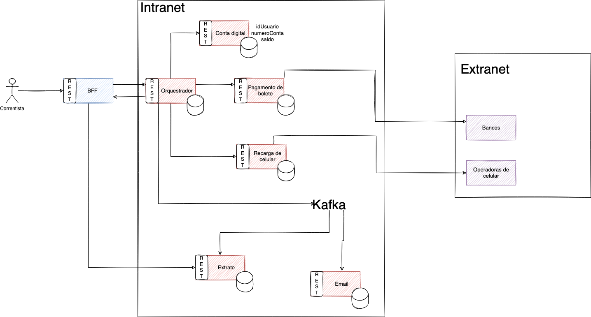

# Conta Digital

Muitos bancos estão aderindo a criação de contas digitais. Nela, todos podem ter acesso a diversos serviços financeiros, como: paragmento de bloquetos, recarga de celular, investimentos, etc.

Nós estamos montanto o **OT-Bank**. E, vamos começar com alguns serviços apenas que são eles:
  - [Conta digital](./conta-digital/)
  - [Extrato](./extrato/)
  - [Orquestrador](./orquestrador/)
  - [BFF](./bff/)
  - [Email](./email/)
  - [Pagamento de boletos](./pagamento-boleto/)
  - [Recarga de celular](./pagamento-boleto/)

A interação desses serviços é represetada pelo diagrama a seguir

## Fluxo

Basicamente, todas as requisições passam pelo **Orquestrador**. Esse serviço é responsável por receber uma requisição do aplicativo e redirecionar para o serviço certo. É nele que toda a lógica fica. Por exemplo, se vamos pagar uma conta, é por meio dele que consultamos o saldo e fazemos o débito do saldo da conta.

Toda transação que o orquestrador efetua lançada para um tópico no _Kafka_ onde o serviço de **Extrato** fica escutando e salvando todas as transações realizadas.

Nossa missão vai começar a estruturar nosso banco digital. Para cada serviço temos algumas tarefas e vamos ver como podemos priorizá-las e ordená-las de modo que façam sentido a sua ordem de execução.

## Dailies
Todo dia faremos uma daily que dura 15 minutos, no máximo. Nessa daily discutiremos os pontos que são impeditivos e documentaremos elas aqui embaixo com as percepções do time. Para isso, basta seguir o modelo

### Dia: 04/10/2021
Percepções:
- Notamos que...
- Tivemos dificuldade em...

